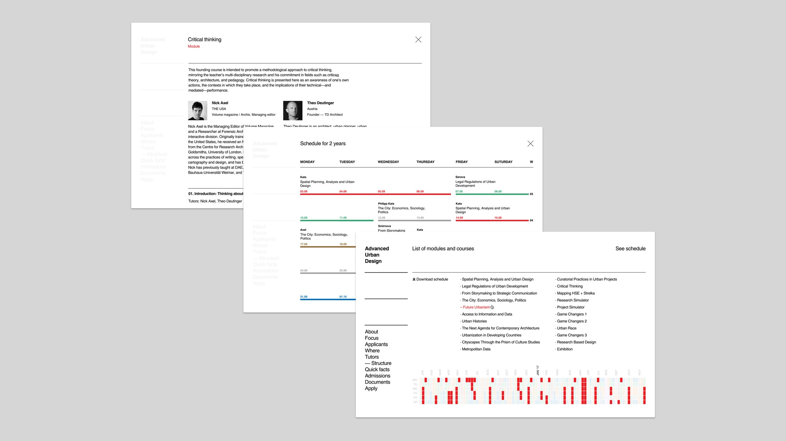
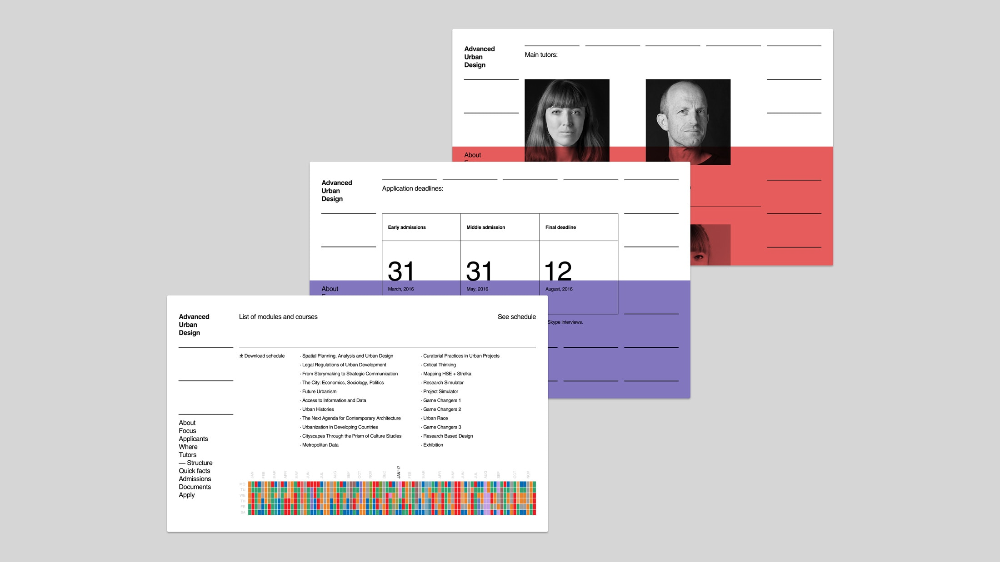
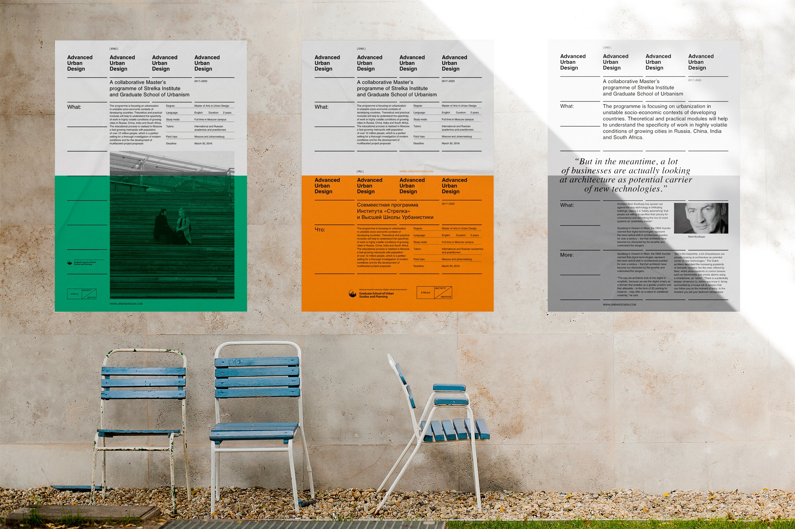

The program is aimed at the next generation of Urban Designers, combining the best of the Russian Academia and the cutting-edge experimental project-based education.

[advancedurbandesign.com](https://advancedurbandesign.com/)

