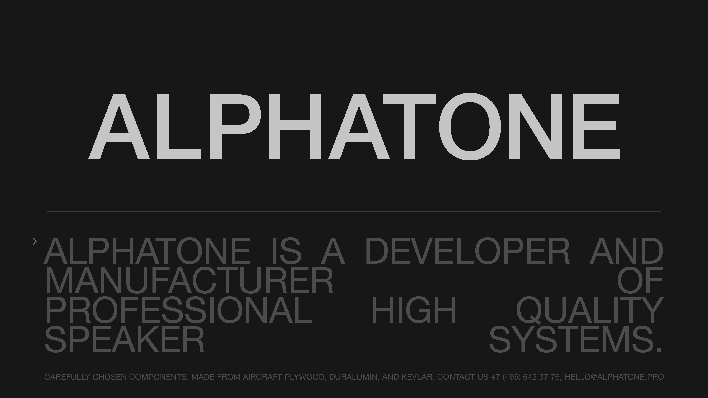
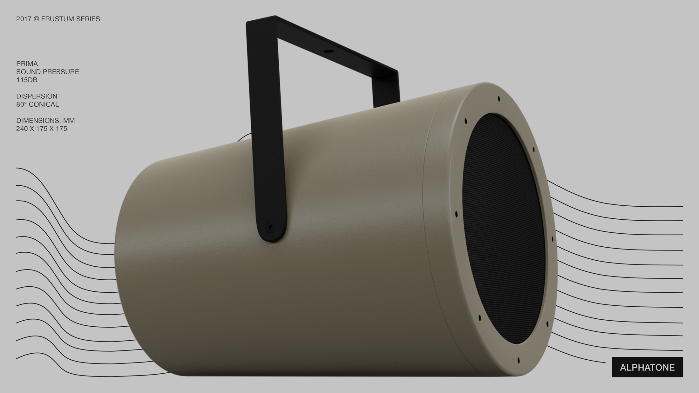
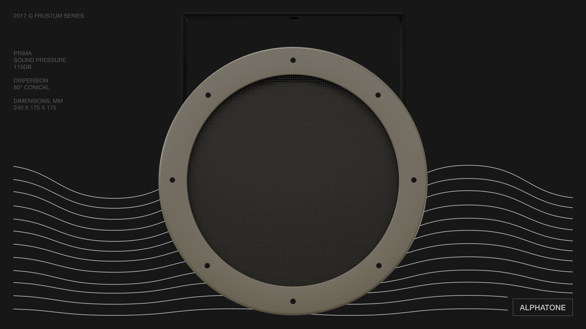
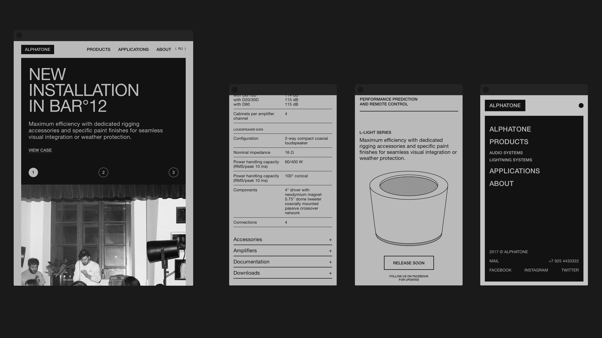
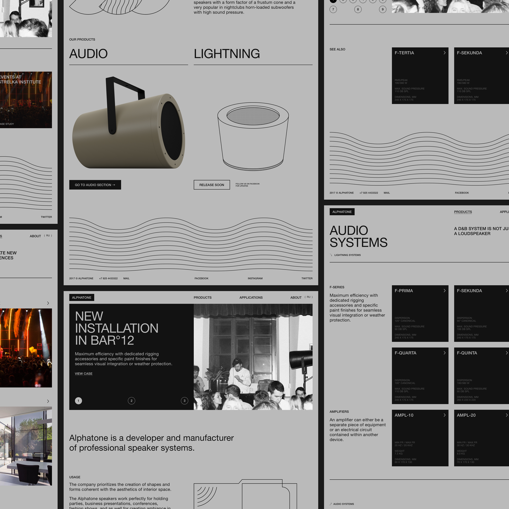

The company prioritizes the creation of shapes and forms coherent with the aesthetics of interior space. The online catalogue follows the same principle, using an ascetic visual language and functional-driven interface.

