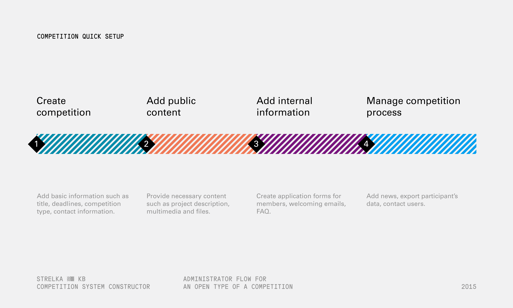
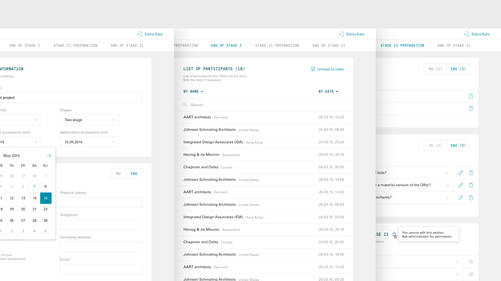
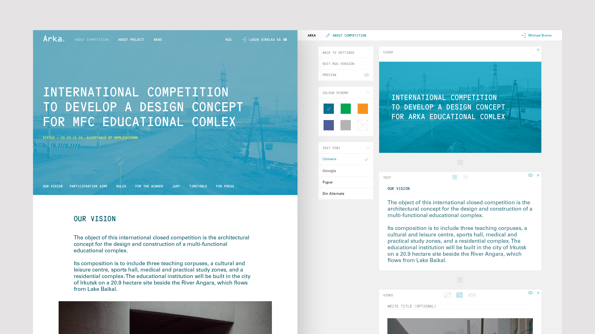
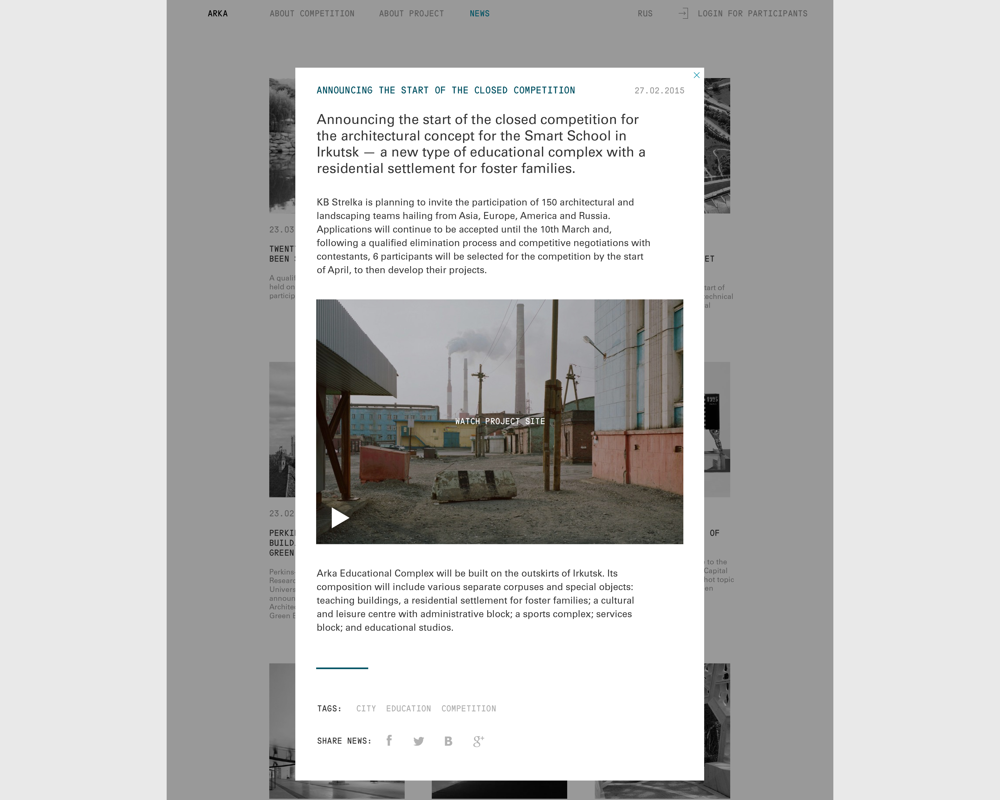
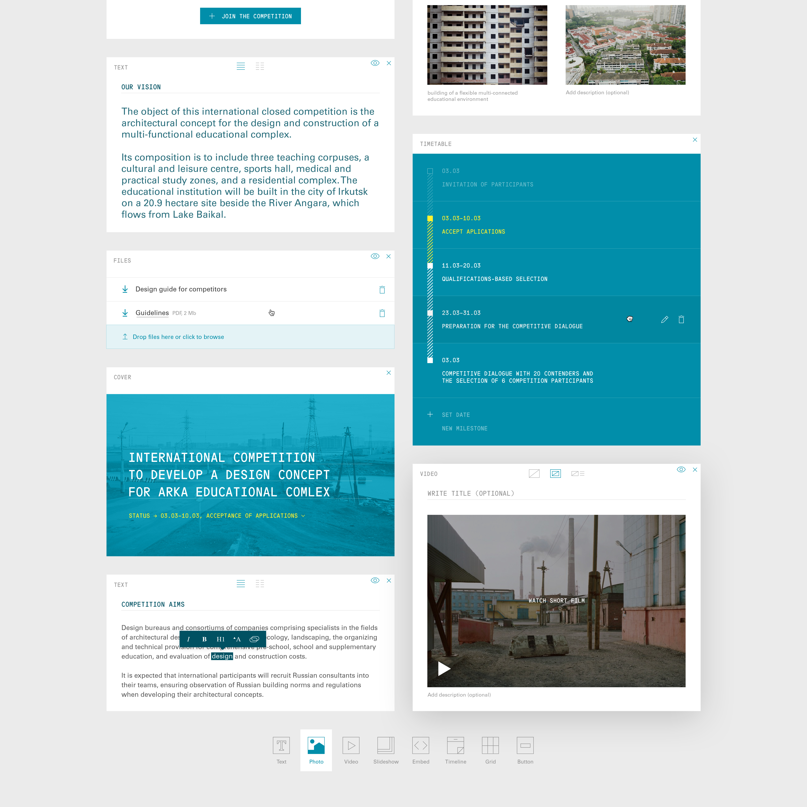
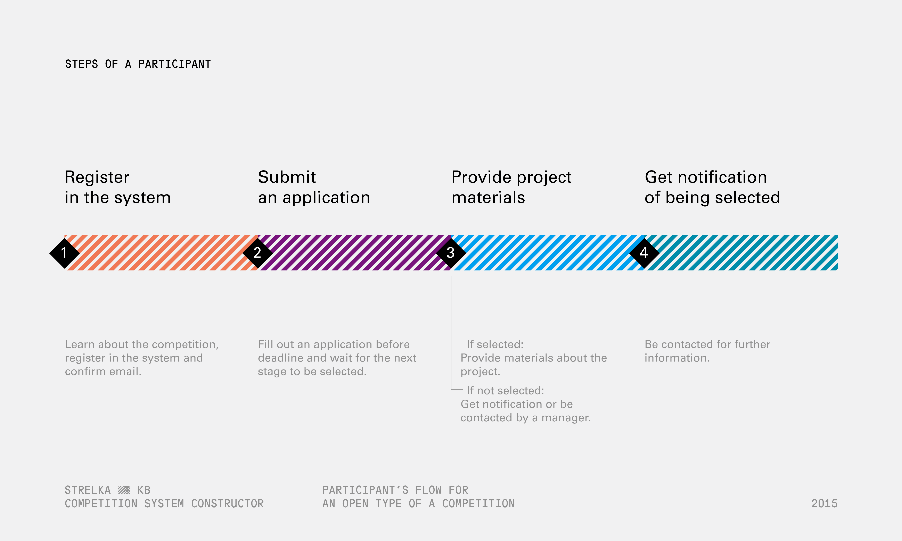
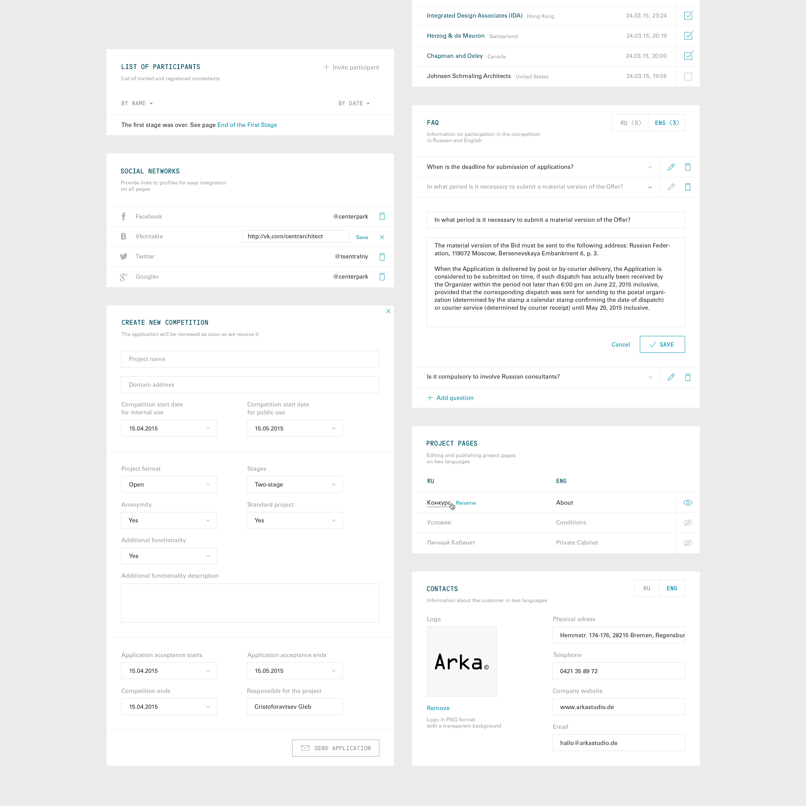

## Goals

- Optimize launch of competitions
- Quickly create typical sites for competitions
- Collect competition materials in one place
- Collect applications and export data.

The editor's interface is divided into logical stages of the competition. Thus, functionality that is not required at a particular stage can be removed.

System provides full control of competition stages. All changes are immediately displayed on public pages.

The participant gets access to all the necessary materials for each stage of the competition separately. After the stage has been completed, access to it is limited. With this logic, the participant gets only up-to-date information within the iterface.

