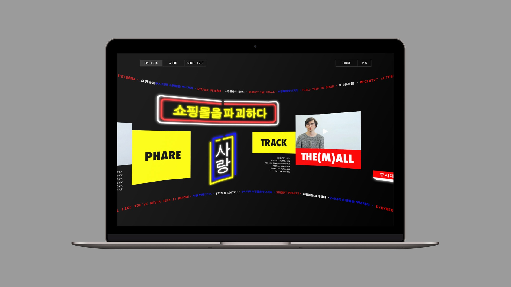
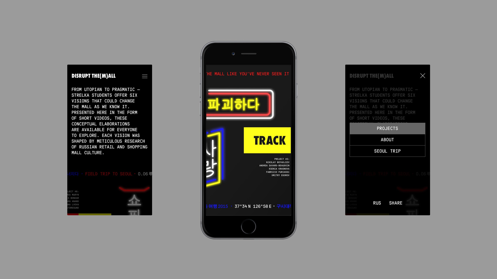

Strelka Institute students developed six proposals that could change the mall as we know it. Projects are presented as short videos on a sphere-like website with shiny ads referring to shopping malls.

[the-m-all.com](https://the-m-all.com/en)

