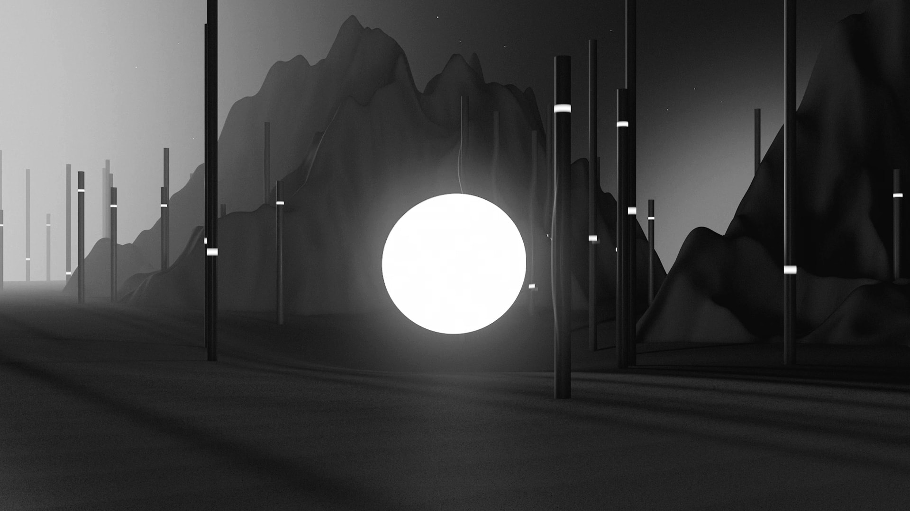

“The 3D-animated journey through mesmerising graphite landscapes [...]. Labyrinths and pulsing geometric shapes represent the eternal cycle of the universe as we follow the shining light into rebirth”.

[The Calvert Journal](http://calvertjournal.com/video/show/5662/jekka-on-and-on)

