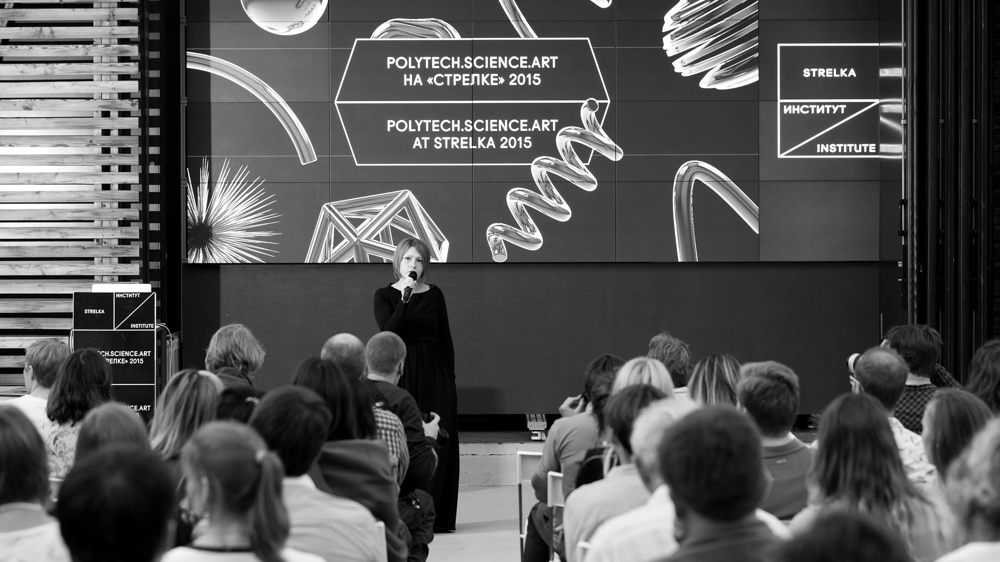
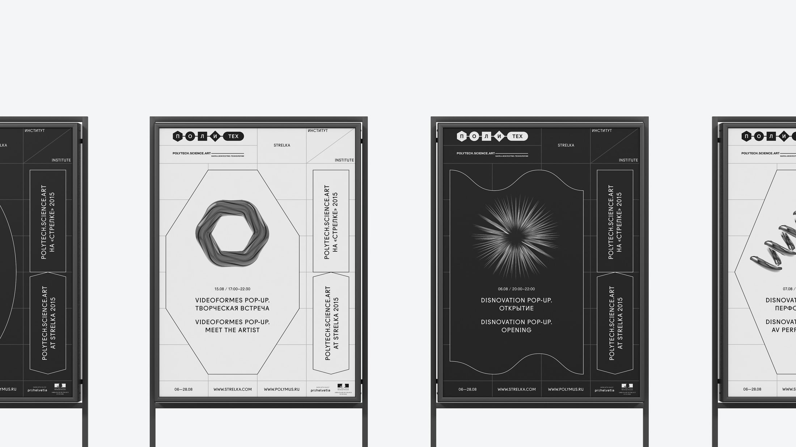
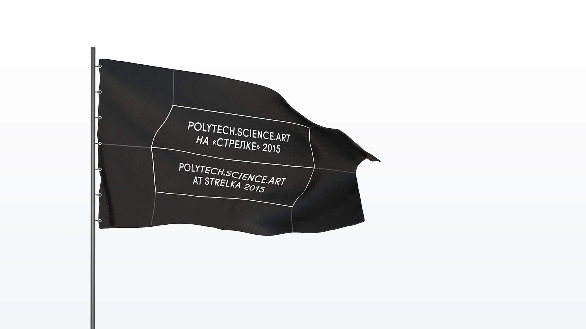
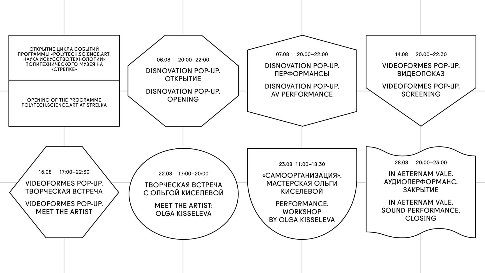

The Polytechnic Museum is one of the oldest science museums in the world. Located in Moscow it emphasises the progress of Russian and Soviet technology and science, as well as modern inventions and developments.

