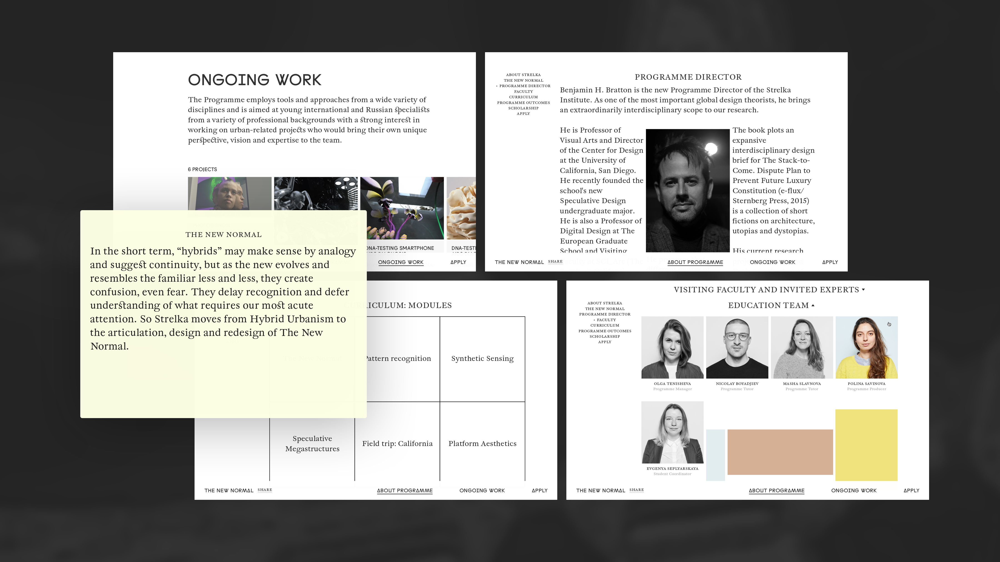

The research focuses on the new contemporary condition, which has emerged with the rapid development of technology, including machine intelligence, biotechnology, automation, and alternative spaces created in VR and AR.

[thenewnormal.strelka.com](https://thenewnormal.strelka.com)

