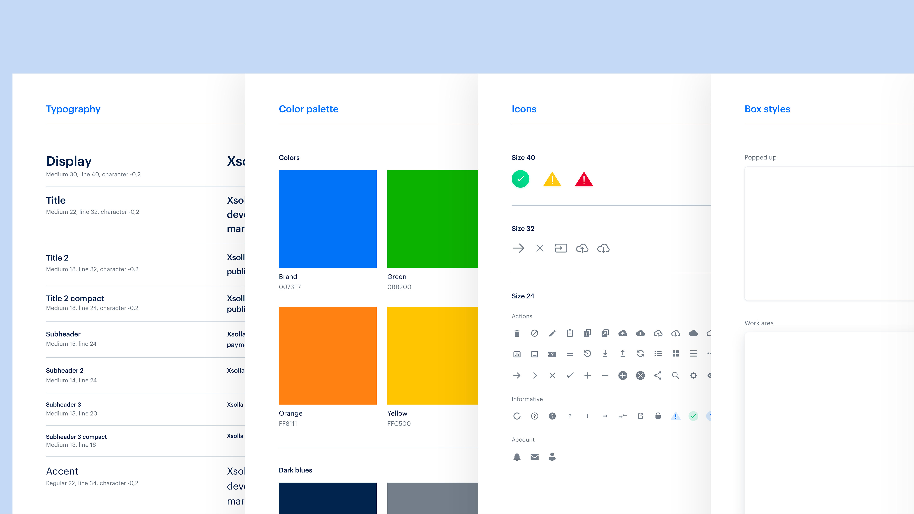
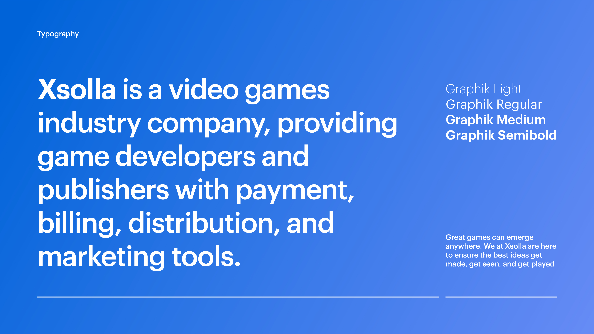
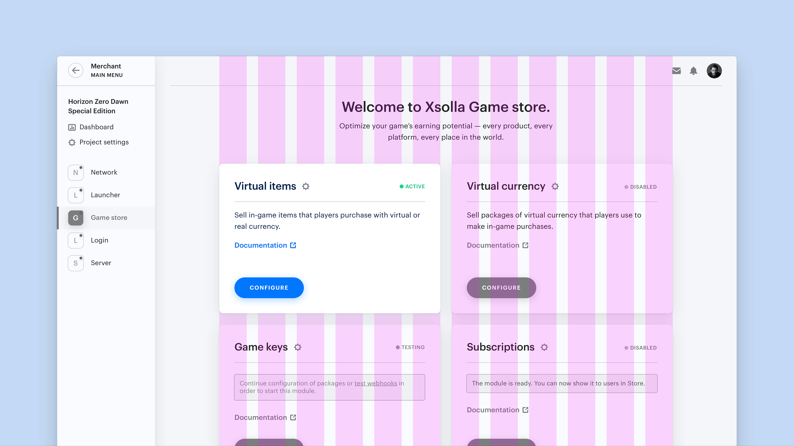
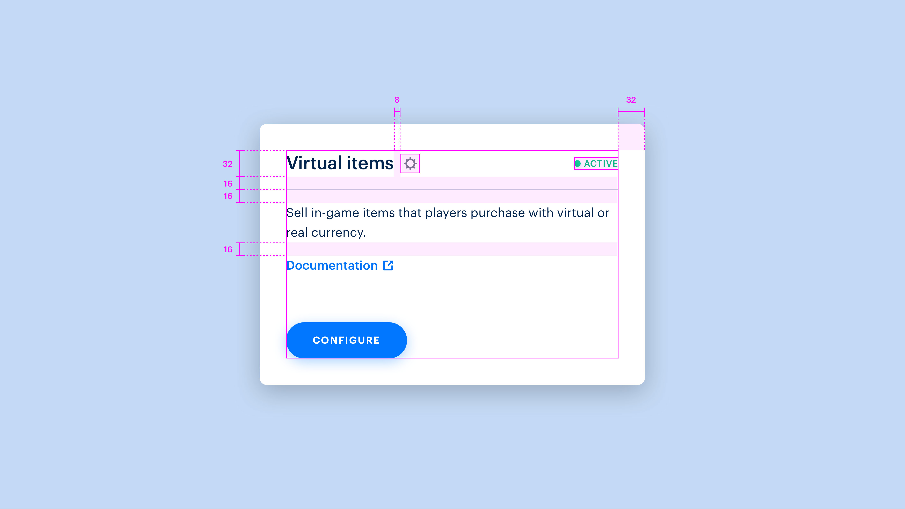
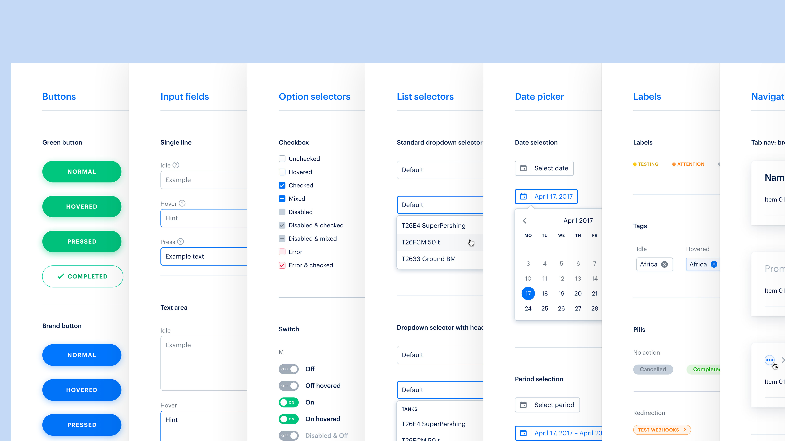
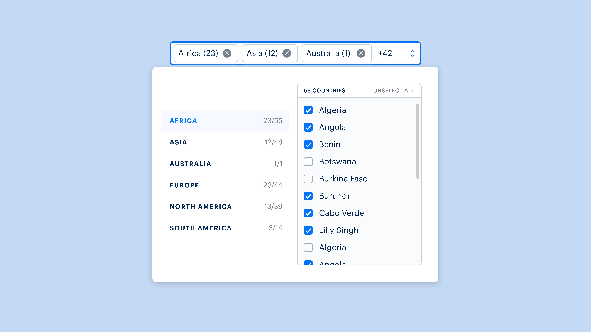

### Client

Headquartered in Los Angeles, Xsolla is a video games industry company, providing game developers and publishers with payment, billing, distribution, and marketing tools.

### Overview

The service is growing and a new audience is coming with its requests. At this point, the platform needs to be consistently reworked based on the new functionality and feedback from users.

### Creating design system

The design system allows Xsolla to create a consistent interface across all services. It simplifies design team collaboration and maintenance of the platform.

#### Style guide

The foundation of the platform's visual identity. Typography, colors, icons.

#### Layouts

Main principles of interfaces. Grid, margins, paddings.

#### Components

Reusable elements, from simple buttons to complex list selectors.

